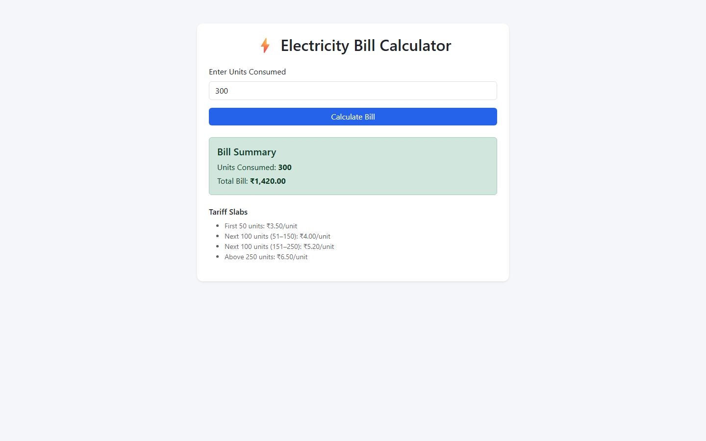

# Electricity Bill Calculator (PHP)

A responsive web application that calculates electricity bills based on a tiered/slab-based tariff system, built using PHP and Bootstrap.

## Features

- User inputs electricity units consumed
- Bill calculated automatically using a 4-tier slab system
- Server-side input validation (rejects negative/non-numeric input)
- Client-side validation for immediate feedback
- Clean, responsive UI using Bootstrap 5
- Clear breakdown of applicable tariff slabs displayed to the user

## Tariff Structure

| Units | Rate |
|---|---|
| First 50 units | ₹3.50/unit |
| Next 100 units (51–150) | ₹4.00/unit |
| Next 100 units (151–250) | ₹5.20/unit |
| Above 250 units | ₹6.50/unit |

## Technologies Used

- PHP 8.2
- HTML5 & CSS3
- Bootstrap 5
- Apache (via XAMPP)

## Installation & Setup

1. Install [XAMPP](https://www.apachefriends.org/) with PHP 8.2+
2. Clone this repository into your XAMPP `htdocs` folder:
```bash
   cd C:\xampp\htdocs
   git clone <repository-url> electricity-bill-php
```
3. Start Apache via the XAMPP Control Panel
4. Open your browser and go to: 
## How to Use

1. Enter the number of electricity units consumed
2. Click "Calculate Bill"
3. View the calculated bill and applicable tariff breakdown

## Testing

Verified against the following boundary values:

| Units | Expected Bill |
|---|---|
| 0 | ₹0.00 |
| 1 | ₹3.50 |
| 50 | ₹175.00 |
| 51 | ₹179.00 |
| 150 | ₹575.00 |
| 151 | ₹580.20 |
| 250 | ₹1,095.00 |
| 251 | ₹1,101.50 |
| 300 | ₹1,420.00 |

## Future Improvements

- Store bill history in a database
- Add support for multiple tariff plans (domestic/commercial)
- PDF bill generation
- Multi-language support

## Screenshots



